Com certeza\! Você está 100% correto. Vamos pegar o `README.md` e formatar a seção "Exploração dos Dados (Consultas SQL)" **exatamente** como você definiu, usando as 8 consultas que você selecionou e seus objetivos.

Esta é a versão final e limpa do seu `README.md`, com as 8 consultas corretas, seus objetivos e os placeholders para os prints, tudo em **um único bloco de código** para você copiar e colar no VS Code.

````markdown
# FIAP - Faculdade de Informática e Administração Paulista

<p align="center">
<a href= "https://www.fiap.com.br/"></a>
</p>

<br>

# 📚 Relatório Final - Fase 3: Banco de Dados e Machine Learning
*(Relatório de Atividades: Importação Oracle e Projeto Opcional de Machine Learning)*


## (Nome do Grupo - ex: Soluções de Dados)

## 👨‍🎓 Integrantes: 
- <a href="#">Maria Luiza Oliveira Carvalho</a> 
- <a href="#">Miriã Leal Mantovani</a>
- <a href="#">João Pedro Santos Azevedo</a> 
- <a href="#">Rodrigo de Souza Freitas</a>

## 👩‍🏫 Professores:
### Tutor(a) 
- <a href="https://github.com/SabrinaOtoni">Sabrina Otoni</a>

## 📜 Descrição do Projeto (Fase 3)

Este repositório documenta os entregáveis da **Fase 3**, que consiste em duas partes principais:

1.  **Atividade Obrigatória:** Carga de dados em um banco relacional Oracle, seguindo os passos de conexão, importação e exploração de dados via consultas SQL.
2.  **Programa Ir Além (Opcional):** Desenvolvimento de um projeto de Machine Learning (Opção 2) para classificação de culturas agrícolas, incluindo EDA, treinamento de 5 modelos e avaliação comparativa.

A estrutura do repositório (`dados/`, `prints/`, `codigos/`) contém todos os artefatos, como o Jupyter Notebook, scripts SQL e imagens de comprovação.

<br>
<br>

---

# I. Atividade Obrigatória: Banco de Dados Oracle

Nesta seção, documentamos a carga dos dados da Fase 2 para o banco de dados Oracle e a exploração via SQL, cumprindo os entregáveis obrigatórios.

## 1. Conexão e Carga dos Dados (Passos Seguidos)

A carga dos dados foi realizada utilizando o **Assistente de Importação** do SQL Developer/DBeaver.

### 1.1. Passos de Conexão

A conexão com o servidor Oracle foi estabelecida com sucesso:

| Parâmetro | Valor |
| :--- | :--- |
| **Host** | `oracle.fiap.com.br` |
| **Porta** | `1521` |
| **SID** | `ORCL` |

**\[Print da Conexão\]**

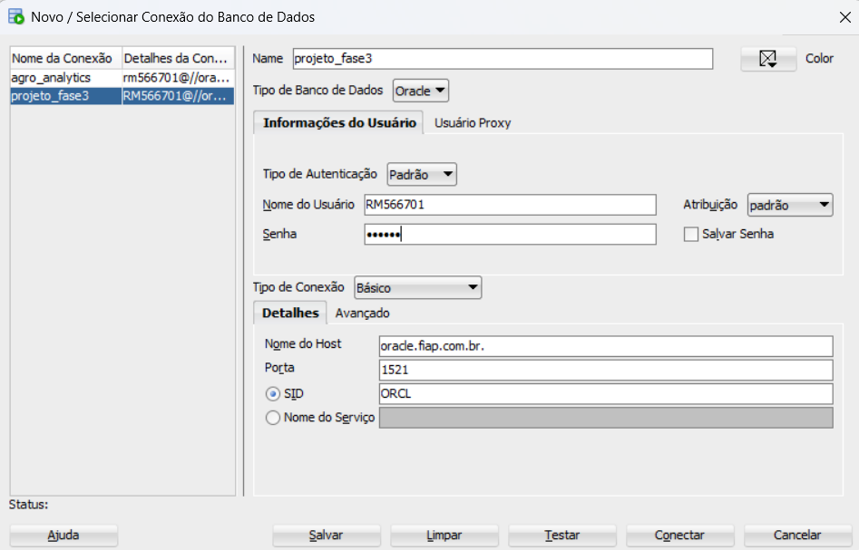

### 1.2. Definição da Estrutura da Tabela

A estrutura da tabela foi definida graficamente no assistente, tipando e corrigindo os nomes de colunas que continham caracteres inválidos.

**\[Print do Mapeamento de Colunas\]**

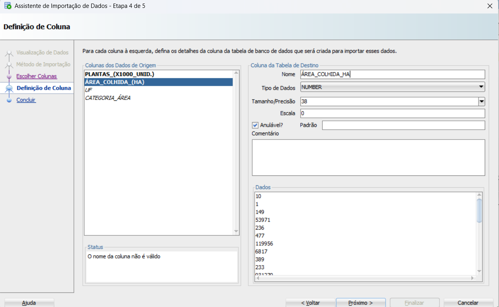

## 2. Exploração dos Dados (Consultas SQL)

O requisito de código foi cumprido pela execução e documentação dos comandos **SELECT** (DQL). Para uma melhor organização, os prints das consultas estão na pasta `prints/oracle/`.

### 2.1. Consultas na Tabela `SENSORES`

#### 2.1.1. Verificação Rápida (10 Linhas)
> **Objetivo:** Mostrar rapidamente que os dados da Fase 2 (Plantas, Área, UF) estão na tabela.
```sql
SELECT
    UF,
    PLANTAS,
    ÁREA_COLHIDA
FROM
    SENSORES
FETCH FIRST 10 ROWS ONLY;
````

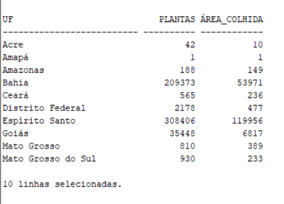

#### 2.1.2. Análise Principal por Categoria

> **Objetivo:** Calcular o total de registros, a soma de plantas e a média de área por categoria.

```sql
SELECT
    CATEGORIA_ÁREA, 
    COUNT(*) AS NUMERO_DE_REGISTROS,
    SUM(PLANTAS) AS TOTAL_PLANTAS,
    ROUND(AVG(ÁREA_COLHIDA), 2) AS MEDIA_AREA_POR_REGISTRO
FROM
    SENSORES
GROUP BY
    CATEGORIA_ÁREA;
```
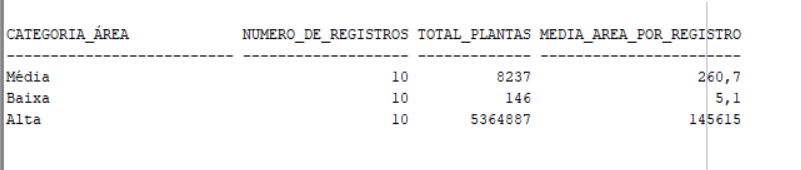

#### 2.1.3. Medidas de Tendência Central (Plantas)

> **Objetivo:** Calcular as estatísticas centrais (Média, Mediana, Máximo) da coluna principal.

```sql
SELECT
    AVG(PLANTAS) AS MEDIA_PLANTAS,
    MEDIAN(PLANTAS) AS MEDIANA_PLANTAS,
    MAX(PLANTAS) AS MAX_PLANTAS
FROM
    SENSORES;
```

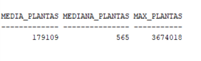

#### 2.1.4. Distribuição por Faixa de Área

> **Objetivo:** Classificar as áreas como 'GRANDE' ou 'PEQUENA' e contar os registros em cada faixa.

```sql
SELECT
    CASE WHEN ÁREA_COLHIDA > 1000 THEN 'GRANDE' ELSE 'PEQUENA' END AS FAIXA_AREA,
    COUNT(*) AS TOTAL_REGISTROS,
    SUM(PLANTAS) AS SOMA_PLANTAS
FROM
    SENSORES
GROUP BY
    CASE WHEN ÁREA_COLHIDA > 1000 THEN 'GRANDE' ELSE 'PEQUENA' END;
```


#### 2.1.5. Ranking de Área Total por Estado (UF)

> **Objetivo:** Mostrar quais estados (UF) possuem a maior soma de área colhida.

```sql
SELECT
    UF,
    SUM(ÁREA_COLHIDA) AS AREA_TOTAL_COLHIDA
FROM
    SENSORES
GROUP BY
    UF
ORDER BY
    AREA_TOTAL_COLHIDA DESC;
```

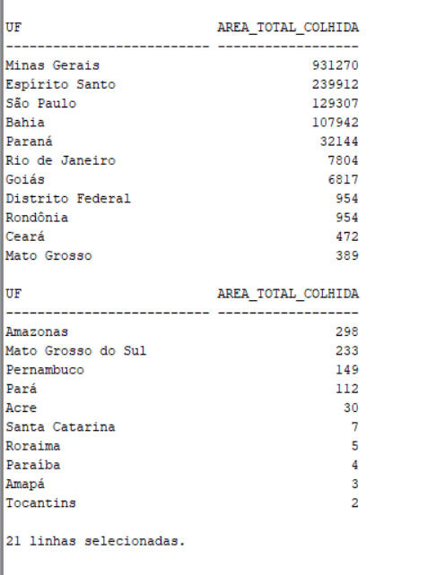

-----

### 2.2. Consultas na Tabela `COLHEITAS`

#### 2.2.1. Análise de Desempenho por Mês de Plantio

> **Objetivo:** Calcular a produtividade média, perda média e preço máximo, agrupados por mês.

```sql
SELECT
    MES_PLANTIO,
    ROUND(AVG(PRODUTIVIDADE_ESPERADA_THA), 2) AS PROD_MEDIA_ESPERADA,
    ROUND(AVG(PERDA_REGISTRADA_THA), 2) AS PERDA_MEDIA,
    MAX(PRECO_TONELADA) AS PRECO_MAXIMO
FROM
    COLHEITAS
GROUP BY
    MES_PLANTIO
ORDER BY
    PROD_MEDIA_ESPERADA DESC;
```
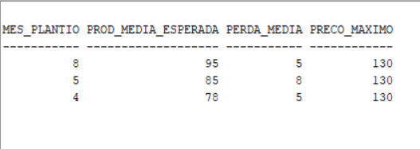

#### 2.2.2. Análise de Perda Total por Mês

> **Objetivo:** Identificar os meses de plantio com a maior soma de perdas registradas.

```sql
SELECT
    MES_PLANTIO,
    SUM(PERDA_REGISTRADA_THA) AS PERDA_TOTAL_THA
FROM
    COLHEITAS
GROUP BY
    MES_PLANTIO
ORDER BY
    PERDA_TOTAL_THA DESC;
```

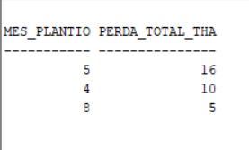

-----

# II. Programa Ir Além: Machine Learning no Agronegócio

Esta seção documenta o projeto opcional de Classificação Multiclasse utilizando o dataset `produtos_agricolas.csv`.

## 3\. Análise Exploratória de Dados (EDA)

O projeto iniciou com a Análise Exploratória, utilizando Python (Jupyter Notebook) para gerar os **5 gráficos obrigatórios**.

### 3.1. Gráfico de Correlação

**Objetivo:** Visualizar as correlações entre as variáveis de solo/clima (`N`, `P`, `K`, etc.).

**\[Print do Gráfico Matriz de Correlação\]**

*(Prints adicionais dos 5 gráficos estão disponíveis no Notebook)*

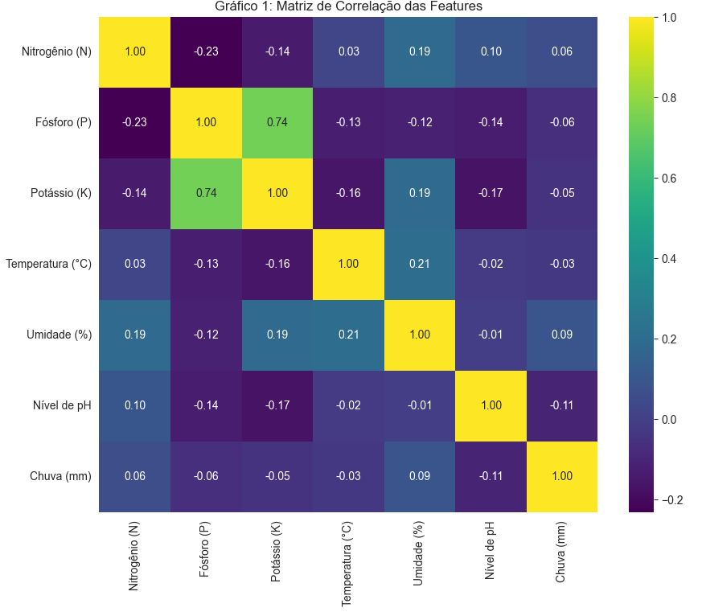
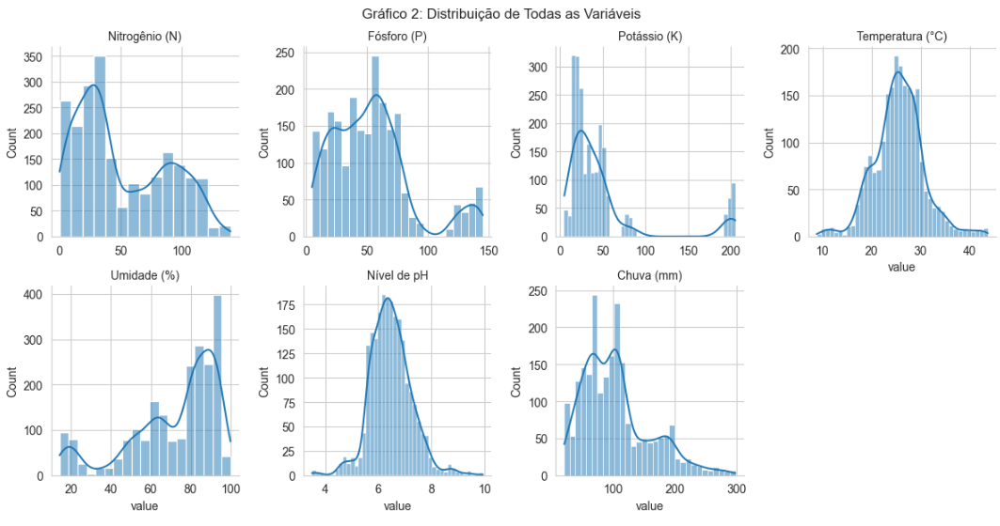
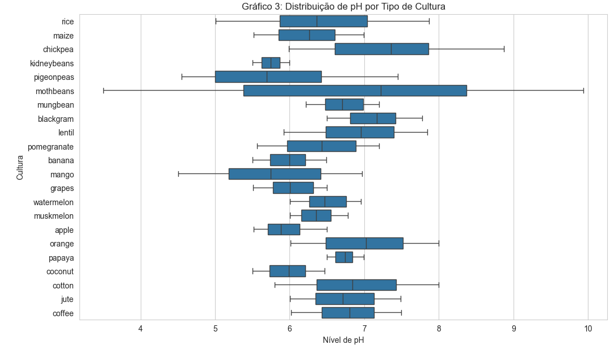


## 4\. Modelagem Preditiva

A modelagem utilizou a arquitetura avançada de **Pipelines** para o treinamento de **5 modelos** preditivos, garantindo a correta aplicação do pré-processamento.

### 4.1. Avaliação Comparativa dos Modelos

A performance dos 5 modelos foi comparada com base na Acurácia e F1-Score no conjunto de teste:

| Algoritmo | Acurácia | F1-Score (Médio) |
| :--- | :--- | :--- |
| **Random Forest** | [XX.XX]% | [XX.XX] |
| **Gradient Boosting** | [YY.YY]% | [YY.YY] |
| **Regressão Logística** | [ZZ.ZZ]% | [ZZ.ZZ] |
| **KNN (Vizinhos)** | [WW.WW]% | [WW.WW] |
| **SVM Linear (SVC)** | [VV.VV]% | [VV.VV] |

**\[Print da Tabela de Resultados Finais do ML\]**

> **Conclusão:** O modelo **[Melhor Modelo, ex: Random Forest]** obteve o melhor desempenho, sendo o mais indicado para o sistema de recomendação de culturas.

*(O código-fonte completo desta análise está disponível em `codigos/SeuNome_RMxxxx_fase3_cap1.ipynb`.)*

-----

## 🔧 Como executar o código

**Atividade Obrigatória (Oracle):**

1.  Os arquivos SQL (`.sql`) estão na pasta `codigos/`.
2.  Eles podem ser executados em qualquer cliente Oracle (SQL Developer, DBeaver) após a configuração da conexão.

**Programa Ir Além (Machine Learning):**

1.  O arquivo `SeuNome_RMxxxx_fase3_cap1.ipynb` (em `codigos/`) deve ser aberto no Jupyter Notebook ou Google Colab.
2.  O dataset `produtos_agricolas.csv` (em `dados/`) deve estar no mesmo diretório de execução.
3.  Instale as dependências (pandas, scikit-learn, seaborn) e execute as células em ordem.

## 🔧 Links

- <a href="https://github.com/joaostazevedo172/maquina_agricola">Github</a>
- <a href="https://youtu.be/JJH5TE2sh8k">Atividade Obrigatória</a>
- <a href="https://youtu.be/Yvhpf3MTfA0">Atividade Opcional</a>

## 🗃 Histórico de lançamentos

  * 0.1.0 - [Data da Entrega]
      * Relatório inicial da Fase 3, incluindo importação Oracle e modelagem de Machine Learning.

## 📋 Licença

\\\<p xmlns:cc="http://creativecommons.org/ns\#" xmlns:dct="http://purl.org/dc/terms/"\>\<a property="dct:title" rel="cc:attributionURL" href="https://github.com/agodoi/template"\>MODELO GIT FIAP\</a\> por \<a rel="cc:attributionURL dct:creator" property="cc:attributionName" href="https://fiap.com.br"\>Fiap\</a\> está licenciado sobre \<a href="http://creativecommons.org/licenses/by/4.0/?ref=chooser-v1" target="\_blank" rel="license noopener noreferrer" style="display:inline-block;"\>Attribution 4.0 International\</a\>.\</p\>

```
```